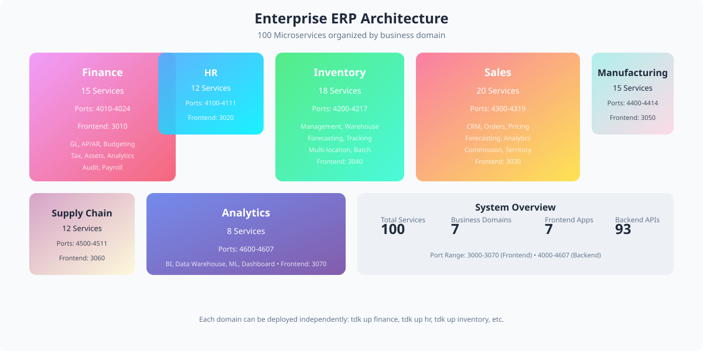

<!-- markdownlint-disable MD013 MD033 MD041 -->

<p align="center">
  
</p>

<p align="center">
  <a href="#run-it">Run it</a>
  &nbsp;&nbsp;/&nbsp;&nbsp;
  <a href="#the-landscape">Explore the landscape</a>
  &nbsp;&nbsp;/&nbsp;&nbsp;
  <a href="#generation">Understand generation</a>
  &nbsp;&nbsp;/&nbsp;&nbsp;
  <a href="#sales-pitch-deck">Sales Pitch Deck</a>
  &nbsp;&nbsp;/&nbsp;&nbsp;
  <a href="#demo-walkthrough">Demo Walkthrough</a>
  &nbsp;&nbsp;/&nbsp;&nbsp;
  <a href="https://github.com/tdk-landscape/tdk-cli">TDK CLI</a>
</p>

<br>

## Enterprise ERP System in One Clone

This repository is a production-grade demonstration of the TDK **Project-Stack-Resource (PSR)** model engineered specifically for **Enterprise Resource Planning (ERP)** with **100 microservices** across 7 business domains: Finance, HR, Inventory, Sales, Manufacturing, Supply Chain, and Analytics.

You declare your enterprise services in simple `service.json` manifests. TDK automatically discovers the landscape, resolves cross-stack dependencies, allocates dynamic port bindings, and generates local Docker, Vite, environment variables, and TypeScript plumbing inside `.autogenerated/`.

<p align="center">
  
</p>

---

## Run It

### Prerequisites

- [Docker](https://docs.docker.com/get-docker/) is running.
- [Tilt](https://docs.tilt.dev/install.html) is installed.
- [Bun 1.2+](https://bun.sh/docs/installation) is installed.
- [TDK CLI](https://github.com/tdk-landscape/tdk-cli#installation) is available as `tdk`.

```bash
git clone https://github.com/tdk-landscape/tdk-erp-system.git
cd tdk-erp-system

# Spin up the entire Enterprise ERP landscape
tdk up
```

TDK discovers all 7 stacks and their 100 underlying resources, allocates non-conflicting ports, and starts the containerized execution graph.

```bash
# Start a specific domain stack (e.g. Finance, HR, Sales, etc.)
tdk up finance
tdk up hr
tdk up inventory
tdk up sales
tdk up manufacturing
tdk up supply_chain
tdk up analytics

# Inspect all running enterprise services
tdk status

# Stop the entire landscape cleanly
tdk down
```

---

## The Landscape

<p align="center">
  
</p>

### Finance Stack (15 services)
| Resource | Type | Runtime | Port | Primary Capability |
| --- | --- | --- | ---: | --- |
| [`general-ledger-api`](services/finance/general-ledger-api) | Backend API | Hono 4 / Bun | [`4010`](http://localhost:4010/health) | Core financial accounting |
| [`accounts-payable-api`](services/finance/accounts-payable-api) | Backend API | Hono 4 / Bun | [`4011`](http://localhost:4011/health) | Vendor payment management |
| [`accounts-receivable-api`](services/finance/accounts-receivable-api) | Backend API | Hono 4 / Bun | [`4012`](http://localhost:4012/health) | Customer invoicing |
| [`budgeting-api`](services/finance/budgeting-api) | Backend API | Hono 4 / Bun | [`4013`](http://localhost:4013/health) | Budget planning & control |
| [`financial-reporting-api`](services/finance/financial-reporting-api) | Backend API | Hono 4 / Bun | [`4014`](http://localhost:4014/health) | Financial statements |
| [`expense-management-api`](services/finance/expense-management-api) | Backend API | Hono 4 / Bun | [`4015`](http://localhost:4015/health) | Employee expense tracking |
| [`tax-compliance-api`](services/finance/tax-compliance-api) | Backend API | Hono 4 / Bun | [`4016`](http://localhost:4016/health) | Tax calculation & filing |
| [`asset-management-api`](services/finance/asset-management-api) | Backend API | Hono 4 / Bun | [`4017`](http://localhost:4017/health) | Fixed asset tracking |
| [`cash-management-api`](services/finance/cash-management-api) | Backend API | Hono 4 / Bun | [`4018`](http://localhost:4018/health) | Cash flow optimization |
| [`banking-integration-api`](services/finance/banking-integration-api) | Backend API | Hono 4 / Bun | [`4019`](http://localhost:4019/health) | Bank connectivity |
| [`financial-analytics-api`](services/finance/financial-analytics-api) | Backend API | Hono 4 / Bun | [`4020`](http://localhost:4020/health) | Financial performance metrics |
| [`payroll-processing-api`](services/finance/payroll-processing-api) | Backend API | Hono 4 / Bun | [`4021`](http://localhost:4021/health) | Payroll calculation |
| [`cost-accounting-api`](services/finance/cost-accounting-api) | Backend API | Hono 4 / Bun | [`4022`](http://localhost:4022/health) | Cost allocation |
| [`revenue-recognition-api`](services/finance/revenue-recognition-api) | Backend API | Hono 4 / Bun | [`4023`](http://localhost:4023/health) | Revenue accounting |
| [`audit-trail-api`](services/finance/audit-trail-api) | Backend API | Hono 4 / Bun | [`4024`](http://localhost:4024/health) | Financial audit logging |
| [`finance-dashboard-app`](services/finance/finance-dashboard-app) | Frontend App | Vite 5 / React | [`3010`](http://localhost:3010) | Finance executive dashboard |

### HR Stack (12 services)
| Resource | Type | Runtime | Port | Primary Capability |
| --- | --- | --- | ---: | --- |
| [`employee-records-api`](services/hr/employee-records-api) | Backend API | Hono 4 / Bun | [`4100`](http://localhost:4100/health) | Employee data management |
| [`recruitment-api`](services/hr/recruitment-api) | Backend API | Hono 4 / Bun | [`4101`](http://localhost:4101/health) | Hiring workflow |
| [`onboarding-api`](services/hr/onboarding-api) | Backend API | Hono 4 / Bun | [`4102`](http://localhost:4102/health) | New hire process |
| [`performance-management-api`](services/hr/performance-management-api) | Backend API | Hono 4 / Bun | [`4103`](http://localhost:4103/health) | Performance reviews |
| [`time-tracking-api`](services/hr/time-tracking-api) | Backend API | Hono 4 / Bun | [`4104`](http://localhost:4104/health) | Time & attendance |
| [`benefits-administration-api`](services/hr/benefits-administration-api) | Backend API | Hono 4 / Bun | [`4105`](http://localhost:4105/health) | Benefits management |
| [`compensation-api`](services/hr/compensation-api) | Backend API | Hono 4 / Bun | [`4106`](http://localhost:4106/health) | Salary & bonuses |
| [`training-api`](services/hr/training-api) | Backend API | Hono 4 / Bun | [`4107`](http://localhost:4107/health) | Learning management |
| [`compliance-api`](services/hr/compliance-api) | Backend API | Hono 4 / Bun | [`4108`](http://localhost:4108/health) | Labor law compliance |
| [`workforce-planning-api`](services/hr/workforce-planning-api) | Backend API | Hono 4 / Bun | [`4109`](http://localhost:4109/health) | Workforce analytics |
| [`employee-portal-api`](services/hr/employee-portal-api) | Backend API | Hono 4 / Bun | [`4110`](http://localhost:4110/health) | Self-service portal |
| [`hr-analytics-api`](services/hr/hr-analytics-api) | Backend API | Hono 4 / Bun | [`4111`](http://localhost:4111/health) | HR metrics & insights |
| [`hr-portal-app`](services/hr/hr-portal-app) | Frontend App | Vite 5 / React | [`3020`](http://localhost:3020) | HR management console |

### Inventory Stack (18 services)
| Resource | Type | Runtime | Port | Primary Capability |
| --- | --- | --- | ---: | --- |
| [`inventory-management-api`](services/inventory/inventory-management-api) | Backend API | Hono 4 / Bun | [`4200`](http://localhost:4200/health) | Core inventory control |
| [`warehouse-management-api`](services/inventory/warehouse-management-api) | Backend API | Hono 4 / Bun | [`4201`](http://localhost:4201/health) | Warehouse operations |
| [`stock-control-api`](services/inventory/stock-control-api) | Backend API | Hono 4 / Bun | [`4202`](http://localhost:4202/health) | Stock level management |
| [`inventory-optimization-api`](services/inventory/inventory-optimization-api) | Backend API | Hono 4 / Bun | [`4203`](http://localhost:4203/health) | Inventory optimization |
| [`product-catalog-api`](services/inventory/product-catalog-api) | Backend API | Hono 4 / Bun | [`4204`](http://localhost:4204/health) | Product information |
| [`sku-management-api`](services/inventory/sku-management-api) | Backend API | Hono 4 / Bun | [`4205`](http://localhost:4205/health) | SKU lifecycle |
| [`inventory-forecasting-api`](services/inventory/inventory-forecasting-api) | Backend API | Hono 4 / Bun | [`4206`](http://localhost:4206/health) | Demand forecasting |
| [`stock-movement-api`](services/inventory/stock-movement-api) | Backend API | Hono 4 / Bun | [`4207`](http://localhost:4207/health) | Stock transactions |
| [`inventory-valuation-api`](services/inventory/inventory-valuation-api) | Backend API | Hono 4 / Bun | [`4208`](http://localhost:4208/health) | Inventory valuation |
| [`cycle-counting-api`](services/inventory/cycle-counting-api) | Backend API | Hono 4 / Bun | [`4209`](http://localhost:4209/health) | Physical counts |
| [`inventory-audit-api`](services/inventory/inventory-audit-api) | Backend API | Hono 4 / Bun | [`4210`](http://localhost:4210/health) | Inventory audits |
| [`multi-location-api`](services/inventory/multi-location-api) | Backend API | Hono 4 / Bun | [`4211`](http://localhost:4211/health) | Multi-site inventory |
| [`inventory-replenishment-api`](services/inventory/inventory-replenishment-api) | Backend API | Hono 4 / Bun | [`4212`](http://localhost:4212/health) | Auto-replenishment |
| [`batch-tracking-api`](services/inventory/batch-tracking-api) | Backend API | Hono 4 / Bun | [`4213`](http://localhost:4213/health) | Batch/lot tracking |
| [`expiry-management-api`](services/inventory/expiry-management-api) | Backend API | Hono 4 / Bun | [`4214`](http://localhost:4214/health) | Expiry date tracking |
| [`inventory-reservation-api`](services/inventory/inventory-reservation-api) | Backend API | Hono 4 / Bun | [`4215`](http://localhost:4215/health) | Stock reservation |
| [`stock-adjustment-api`](services/inventory/stock-adjustment-api) | Backend API | Hono 4 / Bun | [`4216`](http://localhost:4216/health) | Stock adjustments |
| [`inventory-reporting-api`](services/inventory/inventory-reporting-api) | Backend API | Hono 4 / Bun | [`4217`](http://localhost:4217/health) | Inventory reports |
| [`inventory-management-app`](services/inventory/inventory-management-app) | Frontend App | Vite 5 / React | [`3040`](http://localhost:3040) | Inventory control console |

### Sales Stack (20 services)
| Resource | Type | Runtime | Port | Primary Capability |
| --- | --- | --- | ---: | --- |
| [`crm-api`](services/sales/crm-api) | Backend API | Hono 4 / Bun | [`4300`](http://localhost:4300/health) | Customer relationship management |
| [`order-management-api`](services/sales/order-management-api) | Backend API | Hono 4 / Bun | [`4301`](http://localhost:4301/health) | Order processing |
| [`quoting-api`](services/sales/quoting-api) | Backend API | Hono 4 / Bun | [`4302`](http://localhost:4302/health) | Quote generation |
| [`pricing-api`](services/sales/pricing-api) | Backend API | Hono 4 / Bun | [`4303`](http://localhost:4303/health) | Price management |
| [`sales-forecasting-api`](services/sales/sales-forecasting-api) | Backend API | Hono 4 / Bun | [`4304`](http://localhost:4304/health) | Sales predictions |
| [`lead-management-api`](services/sales/lead-management-api) | Backend API | Hono 4 / Bun | [`4305`](http://localhost:4305/health) | Lead tracking |
| [`opportunity-api`](services/sales/opportunity-api) | Backend API | Hono 4 / Bun | [`4306`](http://localhost:4306/health) | Deal pipeline |
| [`sales-analytics-api`](services/sales/sales-analytics-api) | Backend API | Hono 4 / Bun | [`4307`](http://localhost:4307/health) | Sales performance |
| [`commission-api`](services/sales/commission-api) | Backend API | Hono 4 / Bun | [`4308`](http://localhost:4308/health) | Commission calculation |
| [`territory-management-api`](services/sales/territory-management-api) | Backend API | Hono 4 / Bun | [`4309`](http://localhost:4309/health) | Sales territories |
| [`sales-portal-api`](services/sales/sales-portal-api) | Backend API | Hono 4 / Bun | [`4310`](http://localhost:4310/health) | Sales team portal |
| [`contract-management-api`](services/sales/contract-management-api) | Backend API | Hono 4 / Bun | [`4311`](http://localhost:4311/health) | Contract lifecycle |
| [`sales-automation-api`](services/sales/sales-automation-api) | Backend API | Hono 4 / Bun | [`4312`](http://localhost:4312/health) | Sales automation |
| [`customer-portal-api`](services/sales/customer-portal-api) | Backend API | Hono 4 / Bun | [`4313`](http://localhost:4313/health) | Customer self-service |
| [`invoice-generation-api`](services/sales/invoice-generation-api) | Backend API | Hono 4 / Bun | [`4314`](http://localhost:4314/health) | Invoice creation |
| [`payment-processing-api`](services/sales/payment-processing-api) | Backend API | Hono 4 / Bun | [`4315`](http://localhost:4315/health) | Payment handling |
| [`sales-reporting-api`](services/sales/sales-reporting-api) | Backend API | Hono 4 / Bun | [`4316`](http://localhost:4316/health) | Sales reports |
| [`deal-management-api`](services/sales/deal-management-api) | Backend API | Hono 4 / Bun | [`4317`](http://localhost:4317/health) | Deal tracking |
| [`sales-performance-api`](services/sales/sales-performance-api) | Backend API | Hono 4 / Bun | [`4318`](http://localhost:4318/health) | Performance metrics |
| [`quote-to-cash-api`](services/sales/quote-to-cash-api) | Backend API | Hono 4 / Bun | [`4319`](http://localhost:4319/health) | End-to-end sales cycle |
| [`sales-crm-app`](services/sales/sales-crm-app) | Frontend App | Vite 5 / React | [`3030`](http://localhost:3030) | Sales CRM console |

### Manufacturing Stack (15 services)
| Resource | Type | Runtime | Port | Primary Capability |
| --- | --- | --- | ---: | --- |
| [`production-planning-api`](services/manufacturing/production-planning-api) | Backend API | Hono 4 / Bun | [`4400`](http://localhost:4400/health) | Production scheduling |
| [`production-scheduling-api`](services/manufacturing/production-scheduling-api) | Backend API | Hono 4 / Bun | [`4401`](http://localhost:4401/health) | Detailed scheduling |
| [`quality-control-api`](services/manufacturing/quality-control-api) | Backend API | Hono 4 / Bun | [`4402`](http://localhost:4402/health) | Quality assurance |
| [`maintenance-api`](services/manufacturing/maintenance-api) | Backend API | Hono 4 / Bun | [`4403`](http://localhost:4403/health) | Equipment maintenance |
| [`bom-management-api`](services/manufacturing/bom-management-api) | Backend API | Hono 4 / Bun | [`4404`](http://localhost:4404/health) | Bill of materials |
| [`work-order-api`](services/manufacturing/work-order-api) | Backend API | Hono 4 / Bun | [`4405`](http://localhost:4405/health) | Work order management |
| [`shop-floor-control-api`](services/manufacturing/shop-floor-control-api) | Backend API | Hono 4 / Bun | [`4406`](http://localhost:4406/health) | Shop floor monitoring |
| [`capacity-planning-api`](services/manufacturing/capacity-planning-api) | Backend API | Hono 4 / Bun | [`4407`](http://localhost:4407/health) | Capacity optimization |
| [`production-tracking-api`](services/manufacturing/production-tracking-api) | Backend API | Hono 4 / Bun | [`4408`](http://localhost:4408/health) | Real-time tracking |
| [`lean-manufacturing-api`](services/manufacturing/lean-manufacturing-api) | Backend API | Hono 4 / Bun | [`4409`](http://localhost:4409/health) | Lean processes |
| [`equipment-management-api`](services/manufacturing/equipment-management-api) | Backend API | Hono 4 / Bun | [`4410`](http://localhost:4410/health) | Equipment tracking |
| [`recipe-management-api`](services/manufacturing/recipe-management-api) | Backend API | Hono 4 / Bun | [`4411`](http://localhost:4411/health) | Production recipes |
| [`packaging-api`](services/manufacturing/packaging-api) | Backend API | Hono 4 / Bun | [`4412`](http://localhost:4412/health) | Packaging operations |
| [`production-costing-api`](services/manufacturing/production-costing-api) | Backend API | Hono 4 / Bun | [`4413`](http://localhost:4413/health) | Production costs |
| [`manufacturing-analytics-api`](services/manufacturing/manufacturing-analytics-api) | Backend API | Hono 4 / Bun | [`4414`](http://localhost:4414/health) | Manufacturing metrics |
| [`production-control-app`](services/manufacturing/production-control-app) | Frontend App | Vite 5 / React | [`3050`](http://localhost:3050) | Production console |

### Supply Chain Stack (12 services)
| Resource | Type | Runtime | Port | Primary Capability |
| --- | --- | --- | ---: | --- |
| [`procurement-api`](services/supply_chain/procurement-api) | Backend API | Hono 4 / Bun | [`4500`](http://localhost:4500/health) | Procurement management |
| [`supplier-management-api`](services/supply_chain/supplier-management-api) | Backend API | Hono 4 / Bun | [`4501`](http://localhost:4501/health) | Supplier relationships |
| [`purchase-order-api`](services/supply_chain/purchase-order-api) | Backend API | Hono 4 / Bun | [`4502`](http://localhost:4502/health) | PO processing |
| [`supply-chain-planning-api`](services/supply_chain/supply-chain-planning-api) | Backend API | Hono 4 / Bun | [`4503`](http://localhost:4503/health) | Supply chain optimization |
| [`logistics-api`](services/supply_chain/logistics-api) | Backend API | Hono 4 / Bun | [`4504`](http://localhost:4504/health) | Logistics management |
| [`vendor-portal-api`](services/supply_chain/vendor-portal-api) | Backend API | Hono 4 / Bun | [`4505`](http://localhost:4505/health) | Vendor collaboration |
| [`demand-planning-api`](services/supply_chain/demand-planning-api) | Backend API | Hono 4 / Bun | [`4506`](http://localhost:4506/health) | Demand forecasting |
| [`supply-chain-analytics-api`](services/supply_chain/supply-chain-analytics-api) | Backend API | Hono 4 / Bun | [`4507`](http://localhost:4507/health) | Supply chain metrics |
| [`shipping-api`](services/supply_chain/shipping-api) | Backend API | Hono 4 / Bun | [`4508`](http://localhost:4508/health) | Shipping operations |
| [`receiving-api`](services/supply_chain/receiving-api) | Backend API | Hono 4 / Bun | [`4509`](http://localhost:4509/health) | Goods receiving |
| [`supplier-performance-api`](services/supply_chain/supplier-performance-api) | Backend API | Hono 4 / Bun | [`4510`](http://localhost:4510/health) | Supplier evaluation |
| [`supply-chain-risk-api`](services/supply_chain/supply-chain-risk-api) | Backend API | Hono 4 / Bun | [`4511`](http://localhost:4511/health) | Risk management |
| [`supply-chain-app`](services/supply_chain/supply-chain-app) | Frontend App | Vite 5 / React | [`3060`](http://localhost:3060) | Supply chain console |

### Analytics Stack (8 services)
| Resource | Type | Runtime | Port | Primary Capability |
| --- | --- | --- | ---: | --- |
| [`business-intelligence-api`](services/analytics/business-intelligence-api) | Backend API | Hono 4 / Bun | [`4600`](http://localhost:4600/health) | BI & reporting |
| [`data-warehouse-api`](services/analytics/data-warehouse-api) | Backend API | Hono 4 / Bun | [`4601`](http://localhost:4601/health) | Data warehousing |
| [`reporting-api`](services/analytics/reporting-api) | Backend API | Hono 4 / Bun | [`4602`](http://localhost:4602/health) | Report generation |
| [`predictive-analytics-api`](services/analytics/predictive-analytics-api) | Backend API | Hono 4 / Bun | [`4603`](http://localhost:4603/health) | Predictive modeling |
| [`data-governance-api`](services/analytics/data-governance-api) | Backend API | Hono 4 / Bun | [`4604`](http://localhost:4604/health) | Data governance |
| [`dashboard-api`](services/analytics/dashboard-api) | Backend API | Hono 4 / Bun | [`4605`](http://localhost:4605/health) | Dashboard services |
| [`analytics-portal-api`](services/analytics/analytics-portal-api) | Backend API | Hono 4 / Bun | [`4606`](http://localhost:4606/health) | Analytics portal |
| [`machine-learning-api`](services/analytics/machine-learning-api) | Backend API | Hono 4 / Bun | [`4607`](http://localhost:4607/health) | ML model serving |
| [`bi-dashboard-app`](services/analytics/bi-dashboard-app) | Frontend App | Vite 5 / React | [`3070`](http://localhost:3070) | BI analytics console |

```text
tdk-erp-system/
├── Tiltfile
├── TILT_SERVICE_DEFAULTS.star
├── TILT_TECH_STACK.star
├── SALES_PITCH.md
├── DEMO_GUIDE.md
├── docs/
│   ├── readme-hero.svg
│   ├── readme-marquee.svg
│   ├── readme-bento.svg
│   └── readme-flow.svg
└── services/
    ├── finance/ (16 services)
    ├── hr/ (13 services)
    ├── inventory/ (19 services)
    ├── sales/ (21 services)
    ├── manufacturing/ (16 services)
    ├── supply_chain/ (13 services)
    └── analytics/ (9 services)
```

---

## Generation

<p align="center">
  
</p>

Every enterprise resource owns a compact, declarative [`service.json`](services/finance/general-ledger-api/service.json):

```json
{
  "appName": "general-ledger-api",
  "domain": "finance",
  "type": "backend",
  "stack": "finance",
  "port": 4010,
  "dependencies": [],
  "healthCheck": {
    "enabled": true,
    "path": "/health"
  }
}
```

Running `tdk up` turns that manifest into the exact plumbing required by Tilt, Docker, Vite, and Bun.

> [!IMPORTANT]
> Edit `service.json`, `TILT_SERVICE_DEFAULTS.star`, or `TILT_TECH_STACK.star`. Never edit `.autogenerated/` directly; TDK regenerates its contents on every pass.

---

## Project, Stack, Resource (PSR Model)

|| Level | Meaning in TDK Enterprise ERP | Command Surface |
|| --- | --- | --- |
|| **Project** | The entire enterprise landscape (`tdk-erp-system`) | `tdk up`, `tdk down`, `tdk status` |
|| **Stack** | Independent business domain (`finance`, `hr`, `inventory`, `sales`, `manufacturing`, `supply_chain`, `analytics`) | `tdk up finance`, `tdk up hr` |
|| **Resource** | Micro-runnable API, web console, or worker process | `tdk resource <name> ...` |

---

## Sales Pitch Deck & Demo Guide

This repository is tailored for enterprise presentations, architectural reviews, and platform demonstrations:

- 📊 **[Sales Pitch Deck (SALES_PITCH.md)](SALES_PITCH.md):** Executive problem statement, core value pillars, and ROI metrics for enterprise ERP modernization.
- 🎬 **[Demo Walkthrough Guide (DEMO_GUIDE.md)](DEMO_GUIDE.md):** Step-by-step live presentation playbook showing how 100 microservices can be orchestrated without manual configuration.

---

## Testing Individual Resources

Each micro-resource is fully typed, standalone, and testable:

```bash
cd services/finance/general-ledger-api
bun install
bun test
bun run typecheck
```

---

## Architecture Highlights

### Microservice Benefits
- **Domain-Driven Design:** 7 business domains with clear boundaries
- **Independent Deployment:** Each service can be deployed independently
- **Technology Consistency:** Hono 4, Bun 1.2, Vite 5, React 18 across all services
- **Scalability:** Horizontal scaling per domain based on load
- **Resilience:** Failure isolation prevents cascading issues

### Enterprise Features
- **Financial Compliance:** SOX, GAAP, IFRS support through dedicated services
- **HR Governance:** Labor law compliance, GDPR, privacy controls
- **Supply Chain Visibility:** End-to-end tracking from procurement to delivery
- **Manufacturing Excellence:** Lean, Six Sigma, quality control integration
- **Analytics-Driven:** Real-time BI, predictive analytics, ML capabilities

---

<p align="center">
  <strong>Declare the enterprise. Generate the landscape. Accelerate ERP modernization.</strong>
</p>

<p align="center">
  <a href="https://github.com/tdk-landscape">TDK Landscape</a>
  &nbsp;&nbsp;/&nbsp;&nbsp;
  <a href="https://github.com/tdk-landscape/tdk-cli">CLI</a>
  &nbsp;&nbsp;/&nbsp;&nbsp;
  <a href="SALES_PITCH.md">Sales Pitch</a>
  &nbsp;&nbsp;/&nbsp;&nbsp;
  <a href="DEMO_GUIDE.md">Demo Guide</a>
  &nbsp;&nbsp;/&nbsp;&nbsp;
  MIT License
</p>
